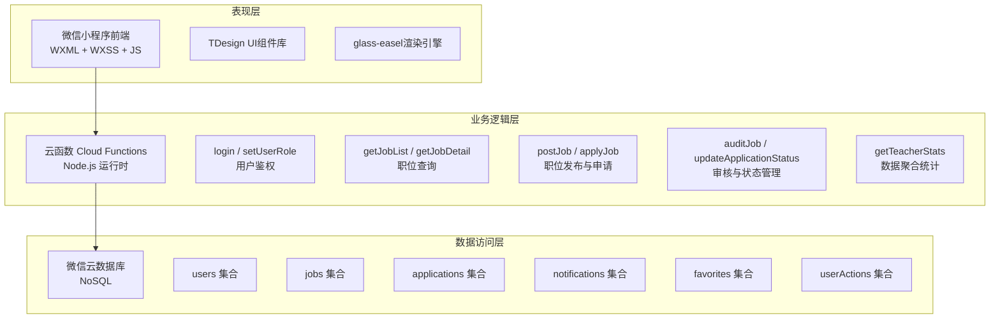
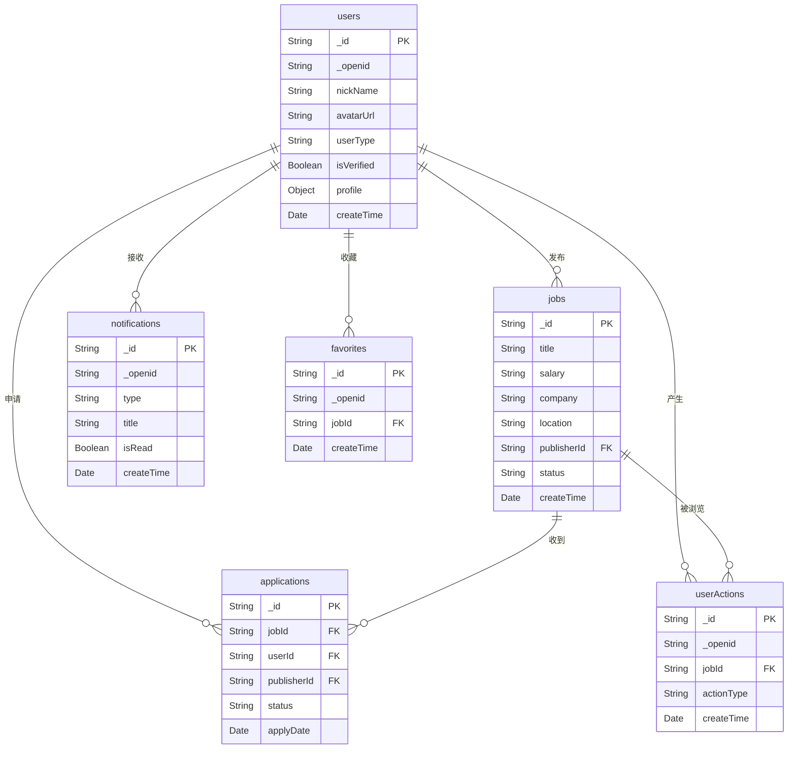
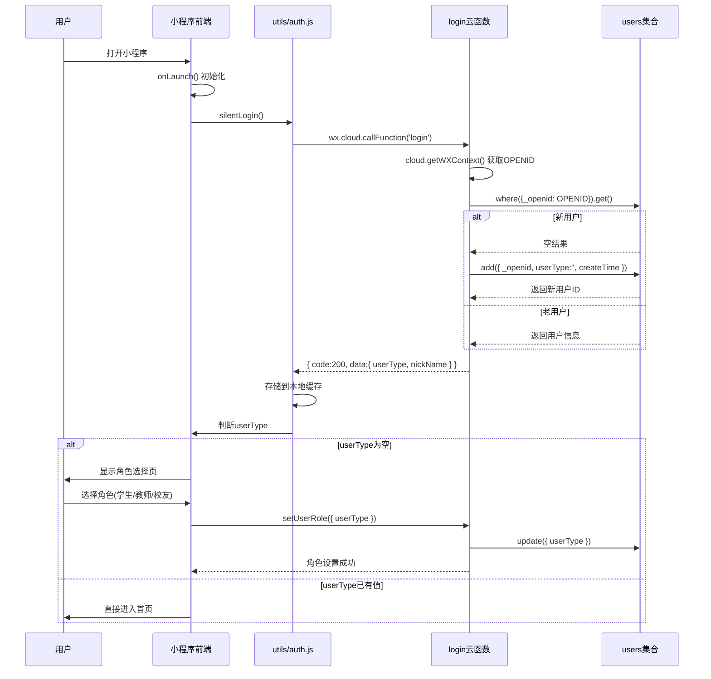
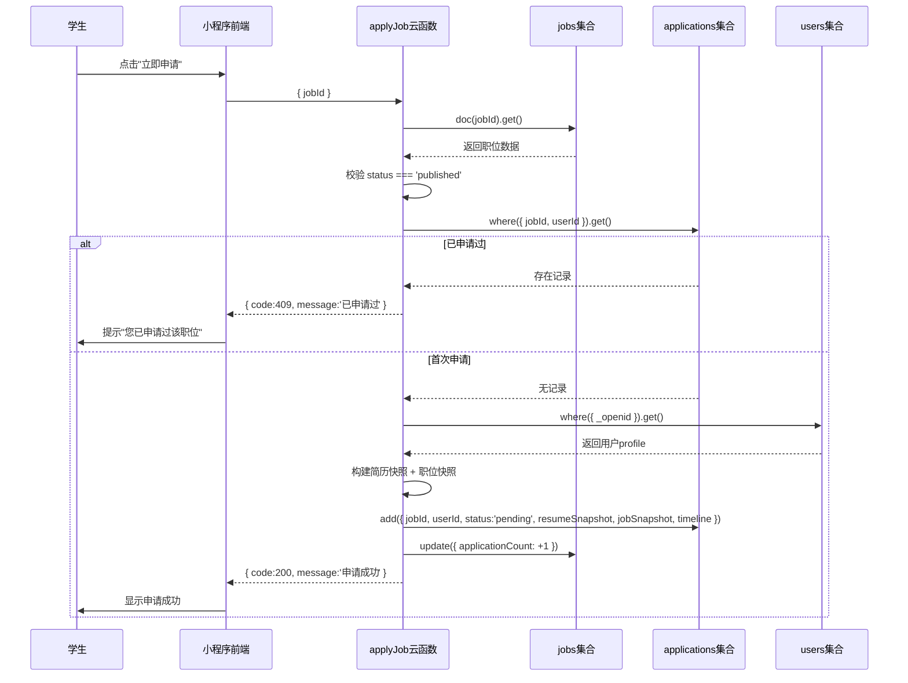
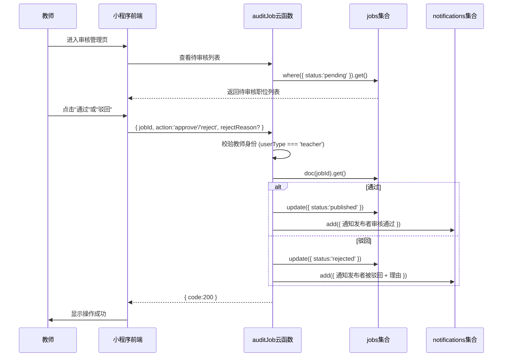
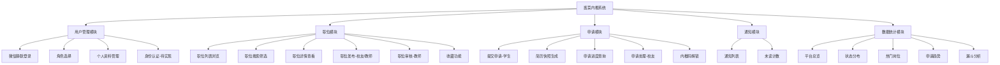
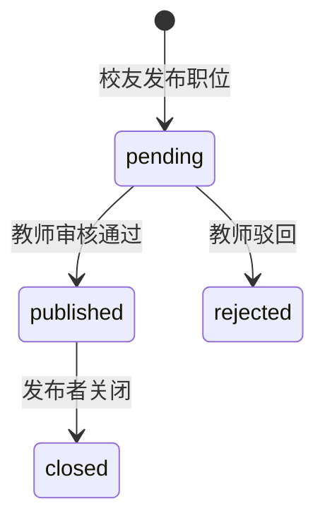
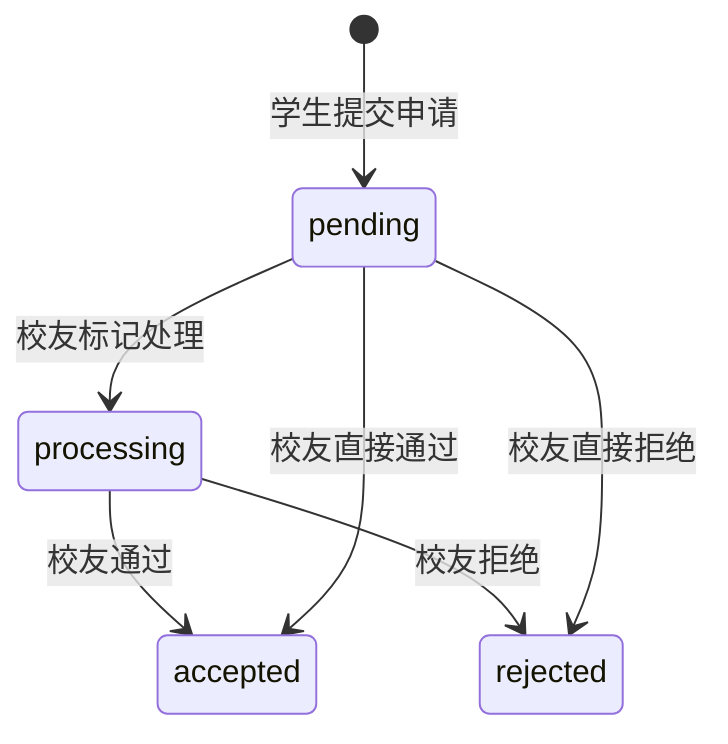

# 论文修改指令文档 — 酱菜内推系统

> 本文档是论文修改的完整指令清单。AI已自动完成的部分标记为 `[已完成]`，需要手动完成或交给AI执行的部分标记为 `[待执行]`。

---

## 已自动完成的修改（v2文件）

以下修改已写入 `实践结课_酱菜内推系统的设计与实现_v2.docx`：

1. ✅ Vue 3 + Vite → 微信小程序原生框架 + TDesign UI + glass-easel
2. ✅ `sys_users` → `users`（5处）
3. ✅ `job_applications` → `applications`（5处）
4. ✅ `behavior_logs` → `userActions`（6处）
5. ✅ 所有字段名 snake_case → camelCase（30+处）
6. ✅ `cloud1-7g2a3h2f` → `cloud1-3g3q2srz04d1d705`
7. ✅ `initData` → `initJobs`（2处）
8. ✅ 响应码 `code: 0` → `code: 200`（4处）
9. ✅ 填充了1.1节"项目开发背景及意义"（原来是"待补充"）
10. ✅ 删除了"这里要改一下，用例活动时序图全都不要画了"的TODO注释
11. ✅ 修正了users集合字段描述（role→userType, base_info→nickName, trust_level→isVerified）
12. ✅ 标注了companies集合"当前版本未建立"

---

## 待执行修改

### === A. 第2章：技术栈描述修改 ===

#### A1. [待执行] 2.2.1 TypeScript段落重写

**原文（约第57行）：**
> TypeScript: 为了提升代码的可维护性、可读性及项目开发的工程化水平，本系统引入了 TypeScript。通过静态类型检查，有效减少了运行时错误，提高了代码的健壮性。在 miniprogram/app.ts 和 miniprogram/utils/util.ts 等文件中可以看到 TypeScript 的应用，其类型定义文件（如 typings/**/*.ts）也进一步规范了开发过程。

**替换为：**
> TypeScript: 本系统在工具函数层（miniprogram/utils/util.ts）引入了 TypeScript，提供日期格式化等基础功能的类型约束。类型定义文件位于 typings/ 目录下，为微信小程序 API 提供类型提示。页面业务逻辑和云函数均使用 JavaScript 编写。

#### A2. [待执行] 2.2.2 补充组件库信息

**在2.2.2前端框架与标记语言节末尾添加：**
> TDesign Miniprogram：本系统采用 TDesign 微信小程序组件库（v1.9.3），提供了按钮、标签、弹窗、搜索框等 13 个全局注册的 UI 组件，确保了界面风格的一致性和用户体验的规范性。渲染引擎采用微信新一代 glass-easel，提升渲染性能。

#### A3. [待执行] 2.2.4 Node.js段落删除重复

**原文（约第66行）** 和 **2.2.3中的Node.js描述** 内容重复。保留2.2.3中的，删除2.2.4整节。

---

### === B. 第3章：用例描述修改 ===

#### B1. [待执行] 注册用例描述（表3-4）→ 微信授权登录

**原注册用例（UC001）：**
> 允许学生用户在系统中创建账户
> 学生用户进入注册页面；输入用户名、手机号、邮箱等注册信息

**替换为（适配微信静默登录）：**

| 字段 | 内容 |
|------|------|
| 用例ID号 | UC001 |
| 用例名称 | 微信授权登录 |
| 参与者 | 所有用户（学生/教师/校友） |
| 简要说明 | 用户通过微信授权自动完成身份识别与系统注册，无需手动填写注册信息。 |
| 前置条件 | 用户已安装微信并打开小程序。 |
| 后置条件 | 系统完成用户身份识别，新用户自动注册，老用户直接登录。 |
| 主事件流 | 1. 用户打开小程序，系统自动调用云函数获取用户 OpenID；2. 系统在 users 集合中查询该 OpenID；3. 若为新用户，系统自动创建用户记录（含 OpenID、创建时间），并引导用户选择角色（学生/教师/校友）；4. 若为老用户，系统返回用户信息（含角色、头像等），直接进入首页；5. 登录完成。 |
| 异常事件流 | A1：网络异常导致云函数调用失败，系统提示用户检查网络后重试。A2：用户首次登录未选择角色，系统限制功能访问，仅展示基础页面。 |

#### B2. [待执行] 登录用例描述（表3-5）→ 角色选择

**原登录用例（UC002）：**
> 学生用户进入登录页面；输入用户名（id）；点击登录按钮

**替换为：**

| 字段 | 内容 |
|------|------|
| 用例ID号 | UC002 |
| 用例名称 | 首次角色选择 |
| 参与者 | 新注册用户 |
| 简要说明 | 新用户首次登录时选择自身角色（学生/教师/校友），角色选定后不可更改。 |
| 前置条件 | 用户已通过微信授权完成自动注册，且尚未选择角色。 |
| 后置条件 | 用户角色写入 users 集合的 userType 字段，后续功能按角色权限开放。 |
| 主事件流 | 1. 新用户登录后，系统检测到 userType 为空；2. 前端展示角色选择页面，提供学生、教师、校友三个选项；3. 用户点击选择角色；4. 前端调用 setUserRole 云函数，传入 userType 参数；5. 云函数验证用户尚未设置角色后，将 userType 写入 users 集合；6. 返回成功，前端跳转至对应角色的首页。 |
| 异常事件流 | A1：用户尝试重复选择角色，系统提示"角色已确定，不可更改"。A2：网络异常，提示重试。 |

#### B3. [待执行] 教师用例（表3-13、3-14）和校友用例（表3-26、3-27）的注册/登录

同理，将这三个角色的注册用例改为与上述UC001相同的微信静默登录描述，登录用例改为角色选择描述。**所有角色的登录注册流程完全一致**（都走微信静默登录 + 角色选择），只是参与者不同。

#### B4. [待执行] 身份认证用例（表3-7、3-16、3-29）

**当前描述**：用户上传身份证照片进行认证
**实际实现**：身份认证功能尚未开发，当前通过管理员在数据库中手动设置 userType 实现角色分配。

**替换为（标注为"待实现"）：**

| 字段 | 内容 |
|------|------|
| 用例ID号 | UC004 |
| 用例名称 | 身份认证（待实现） |
| 参与者 | 所有已登录用户 |
| 简要说明 | 用户通过实名信息验证确保身份真实性。当前版本通过后台数据库手动赋值实现角色权限管理，未来版本将实现前端自助认证流程。 |
| 前置条件 | 用户已登录并完成角色选择。 |
| 后置条件 | 用户 isVerified 字段更新为 true。 |
| 主事件流 | （当前版本）1. 管理员在云开发控制台的 users 集合中，手动将目标用户的 isVerified 字段设为 true。（未来版本）用户提交认证材料，管理员后台审核通过后自动更新。 |
| 异常事件流 | A1：认证材料不符合要求，管理员拒绝审核。 |

#### B5. [待执行] 删除/标注以下未实现功能的用例

| 用例 | 处理方式 |
|------|---------|
| 生成分享二维码（UC029，表3-32） | 标注"当前版本以文字复制方式降级实现" |
| 关联学生老师（UC028，表3-31） | 删除此用例，代码中无此功能 |
| 查看收藏数量（UC009，表3-12） | 保留，收藏功能已通过 toggleFavorite 实现 |
| 教师处理申请（UC015/UC016） | 修正：实际是**校友**处理申请（updateApplicationStatus），教师只审核职位（auditJob） |

#### B6. [待执行] 修正教师角色描述

论文中多处写"教师处理学生申请"，但实际代码中：
- **教师**：审核职位（auditJob：approve/reject职位发布）
- **校友**：处理申请（updateApplicationStatus：通过/拒绝学生申请）

这是一个贯穿全文的角色混淆，需要在以下位置修正：
- 3.1.2 教师用户功能描述
- 3.2.2 教师用例分析
- 表3-15到表3-25 中的"通过申请"、"拒绝申请"用例 → 应改为"审核职位"用例
- 3.3.3 发布岗位活动分析中关于教师审核的描述

---

### === C. 第4章：数据库设计修改 ===

#### C1. [已完成] 集合名和字段名修正
已通过批量替换完成。

#### C2. [待执行] 4.3.3.1 users集合结构表重写

**当前表格描述的字段（role/base_info/trust_level等）与实际不符。替换为：**

| 字段名 | 类型 | 必填 | 说明 |
|--------|------|------|------|
| _id | String | 是 | 数据库自动生成的唯一主键 |
| _openid | String | 是 | 微信用户唯一标识（鉴权核心） |
| nickName | String | 否 | 用户昵称 |
| avatarUrl | String | 否 | 用户头像URL |
| userType | String | 是 | 用户角色：student（学生）、alumni（校友）、teacher（教师）、admin（管理员），首次选择后不可更改 |
| isVerified | Boolean | 是 | 身份是否已认证（默认 false） |
| profile | Object | 否 | 角色扩展信息（差异化存储） |
| createTime | Date | 是 | 注册时间（服务器时间） |
| updateTime | Date | 否 | 最后更新时间 |

**profile 字段详细说明：**
- 学生：`{ student: { department, major, resume: {...} } }`
- 校友：`{ alumni: { graduationYear, company, jobTitle } }`
- 教师：`{ teacher: { department, title } }`

#### C3. [待执行] 4.3.3.3 jobs集合结构表重写

| 字段名 | 类型 | 必填 | 说明 |
|--------|------|------|------|
| _id | String | 是 | 职位唯一标识 |
| title | String | 是 | 职位名称 |
| salary | String | 是 | 薪资范围（如"15k-25k"） |
| company | String | 是 | 所属公司名称 |
| location | String | 是 | 工作地点 |
| tags | Array | 否 | 职位标签数组（如["Java","后端"]） |
| description | String | 否 | 职位描述 |
| requirements | String | 否 | 任职要求 |
| recommenderComment | String | 否 | 内推人寄语 |
| referralCode | String | 否 | [敏感] 内推码，仅申请通过后可见 |
| contactWechat | String | 否 | [敏感] 内推微信号，仅申请通过后可见 |
| jobLink | String | 否 | 岗位详情链接 |
| publisherId | String | 是 | 发布人 OpenID |
| publisherName | String | 否 | 发布人姓名 |
| publisher | Object | 否 | 发布人快照（含 openid, name, userType） |
| status | String | 是 | 状态：pending（待审核）、published（招聘中）、closed（已关闭）、rejected（被驳回） |
| applicationCount | Number | 否 | 收到的申请数量（自动计数） |
| likeCount | Number | 否 | 收藏数 |
| expectedMajors | String | 否 | 期望专业（申请门槛） |
| minGrade | String | 否 | 最低年级要求（申请门槛） |
| createTime | Date | 是 | 创建时间 |
| updateTime | Date | 否 | 最后更新时间 |

#### C4. [待执行] 4.3.3.4 applications集合结构表重写

| 字段名 | 类型 | 必填 | 说明 |
|--------|------|------|------|
| _id | String | 是 | 申请唯一标识 |
| jobId | String | 是 | 关联职位 ID |
| userId | String | 是 | 申请人 OpenID |
| publisherId | String | 是 | 职位发布人 OpenID（冗余，便于校友快速查询） |
| status | String | 是 | 流程状态：pending（待处理）、processing（处理中）、accepted（已通过）、rejected（不合适） |
| endorsementData | Object | 否 | 背书教师信息 |
| resumeSnapshot | Object | 否 | 简历快照（投递时固化，防止后续修改导致信息不一致） |
| jobSnapshot | Object | 否 | 职位快照（含 title, company, salary） |
| timeline | Array | 是 | 全流程进度数据：`[{status, time, desc}]` |
| remark | String | 否 | 校友反馈/备注 |
| applyDate | Date | 是 | 申请时间 |
| updateTime | Date | 否 | 最后更新时间 |

#### C5. [待执行] 4.3.3.5 userActions集合结构表重写

| 字段名 | 类型 | 必填 | 说明 |
|--------|------|------|------|
| _id | String | 是 | 日志 ID |
| _openid | String | 是 | 产生行为的用户 OpenID |
| jobId | String | 是 | 目标职位 ID |
| actionType | String | 是 | 行为类型：view（浏览）、apply（投递）、share（分享） |
| stayDuration | Number | 否 | 页面停留时长（秒） |
| createTime | Date | 是 | 行为发生时间 |

#### C6. [待执行] 删除以下不存在的集合描述
- 4.3.3.6 标签集合（tags）→ **删除整节**，系统无独立标签集合
- 4.3.3.2 企业集合（companies）→ **改为说明**，企业名称直接存储在 jobs 集合的 company 字段中

#### C7. [待执行] 补充遗漏的集合

| 集合名 | 说明 |
|--------|------|
| favorites | 收藏记录，字段：_openid, jobId, createTime |
| notifications | 通知记录，字段：_openid, type, title, content, isRead, relatedId, createTime |

---

### === D. 第4.2节：功能模块描述修正 ===

#### D1. [待执行] 4.2.1 用户认证模块

**当前描述**中提到的 "sys_users 集合"、"学生学籍认证"、"校友身份认证"、"在线简历"、"企业库关联"等功能，大部分与实际不符。

**替换为（精简版，与实际代码一致）：**

> **4.2.1 用户认证与个人中心**
>
> 功能描述：基于微信 OpenID 实现静默登录与角色分流，通过统一 users 集合存储所有角色的差异化信息。
>
> 子功能：
> - 微信静默登录：调用 login 云函数获取用户 OpenID，查询 users 集合。新用户自动注册，老用户返回已有信息。
> - 角色选择引导：新用户首次登录需选择角色（student/alumni/teacher），调用 setUserRole 云函数写入 userType 字段，选定后不可更改。
> - 个人信息管理：用户可编辑昵称、头像，通过 updateProfile 云函数更新。角色扩展信息存储在 profile 字段中。
> - 身份认证（待实现）：当前通过管理员后台手动设置 isVerified 字段实现，未来版本将开发前端自助认证流程。

#### D2. [待执行] 4.2.4 申请模块角色修正

**当前描述**写的是"教师审核申请"，实际是"校友处理申请"。

修正要点：
- 3.2 候选人处理 → 改为 **校友端** 处理申请
- 状态值：0/1/2/3 → pending/processing/accepted/rejected
- "教师审核职位"（auditJob）是独立的职位审核功能，不是处理学生申请

#### D3. [待执行] 4.2.4 推荐算法模块

论文中描述的"协同过滤算法"、"User-CF"、"定时触发器"等功能**均未实现**。

**处理方式**：标注为"系统预留了行为日志（userActions 集合）和埋点云函数（recordUserAction），为未来版本实现推荐算法提供数据基础。当前版本职位列表按发布时间倒序排列。"

---

### === E. 第5章：详细设计修正 ===

#### E1. [待执行] 5.1.1 登录注册模块流程图描述重写

**原文描述**的流程是"判断用户是否已登录"、"调用后端云函数login处理"。

**替换为（与 auth.silentLogin 一致）：**

> 小程序启动时（app.js 的 onLaunch），首先初始化云开发环境，随后调用 auth.silentLogin() 方法。该方法通过 wx.cloud.callFunction 调用 login 云函数获取用户 OpenID。login 云函数在 users 集合中查询该 OpenID：若存在，返回用户信息（含 userType、nickName 等）；若不存在，自动创建新用户记录并返回。前端根据返回的 userType 判断：若为空（新用户），引导进入角色选择页面；若已有值，直接进入首页。整个登录过程对用户透明，无需手动操作。

#### E2. [待执行] 5.1.3 推荐模块 → 改为"教师审核模块"

**原文**标题是"推荐模块"，描述的却是"管理员审核"流程，且内容混乱。

**替换为：**

> **5.1.3 教师审核模块**
> 教师用户登录系统后，可在个人中心进入审核管理界面。系统展示待审核的职位列表（status 为 pending 的职位）。教师点击某一职位查看详情后，可选择"通过"或"驳回"操作：若通过，调用 auditJob 云函数将职位 status 更新为 published，同时自动发送通知告知发布者审核通过；若驳回，需填写驳回理由，职位 status 更新为 rejected，同样通知发布者。审核流程至此结束。

---

### === F. 第6章：代码修正 ===

#### F1. [待执行] 6.3.1.1 全局应用逻辑代码替换

**当前代码**是虚构的 app.ts（含 IAppOption 类型），且云环境ID错误。

**替换为实际 app.js 代码：**

```javascript
// miniprogram/app.js
const auth = require('./utils/auth.js')

App({
  onLaunch() {
    const logs = wx.getStorageSync('logs') || []
    logs.unshift(Date.now())
    wx.setStorageSync('logs', logs)

    // 初始化云开发环境
    if (!wx.cloud) {
      console.error('请使用 2.2.3 或以上的基础库以使用云能力')
    } else {
      wx.cloud.init({
        env: 'cloud1-3g3q2srz04d1d705',
        traceUser: true
      })
      // 静默登录：自动获取/注册用户信息
      auth.silentLogin()
    }
  },
  globalData: {
    userInfo: null
  }
})
```

#### F2. [待执行] 6.3.1.2 页面逻辑代码替换

**当前代码**是虚构的简化版 job_list.js。

**替换为实际代码模式的描述（可适当简化）：**

> ```javascript
> // miniprogram/pages/job_list/job_list.js 核心逻辑（节选）
> Page({
>   data: {
>     jobList: [],
>     keyword: '',
>     city: '',
>     jobType: '',
>     pageNum: 1,
>     hasMore: true,
>     loading: false
>   },
>   onLoad() {
>     this.loadJobList()
>   },
>   onShow() {
>     // 每次显示时刷新，确保数据最新
>     this.setData({ pageNum: 1, jobList: [], hasMore: true })
>     this.loadJobList()
>   },
>   loadJobList() {
>     if (this.data.loading || !this.data.hasMore) return
>     this.setData({ loading: true })
>     wx.cloud.callFunction({
>       name: 'getJobList',
>       data: {
>         pageNum: this.data.pageNum,
>         pageSize: 10,
>         keyword: this.data.keyword,
>         city: this.data.city,
>         jobType: this.data.jobType
>       }
>     }).then(res => {
>       const result = res.result
>       if (result.code === 200) {
>         this.setData({
>           jobList: [...this.data.jobList, ...result.data.list],
>           hasMore: result.data.hasMore,
>           pageNum: this.data.pageNum + 1,
>           loading: false
>         })
>       }
>     })
>   }
> })
> ```

#### F3. [待执行] 6.3.2.1 登录云函数代码替换

**当前代码**使用 `code` 参数。**替换为实际 login 云函数代码**（见 cloudfunctions/login/index.js，已在论文中部分正确，但需要更新描述文字）。

修改描述文字：
> ~~"前端小程序获取登录凭证 code，将其传递至后端云函数"~~ →
> "前端通过 wx.cloud.callFunction 直接调用 login 云函数，云函数通过 cloud.getWXContext() 获取用户 OpenID，无需前端传递任何参数"

#### F4. [待执行] 6.3.2.2 数据查询云函数代码替换

**当前 getJobList 代码**使用 `category/location/salaryRange/skip/limit`。

**替换为实际参数签名：**

> ```javascript
> // cloudfunctions/getJobList/index.js 核心逻辑（节选）
> exports.main = async (event, context) => {
>   const { pageNum = 1, pageSize = 10, keyword, city, jobType, sortBy } = event
>
>   // 构建筛选条件
>   const filter = { status: 'published' }
>   if (keyword) {
>     filter.title = db.RegExp({ regexp: keyword, options: 'i' })
>   }
>   if (city) filter.location = city
>   if (jobType) filter.tags = db.command.elemMatch(db.command.eq(jobType))
>
>   const skip = (pageNum - 1) * pageSize
>   const [countRes, listRes] = await Promise.all([
>     db.collection('jobs').where(filter).count(),
>     db.collection('jobs').where(filter)
>       .orderBy(sortBy || 'createTime', 'desc')
>       .skip(skip).limit(pageSize).get()
>   ])
>
>   return {
>     code: 200,
>     data: { list: listRes.data, total: countRes.total, hasMore: skip + pageSize < countRes.total }
>   }
> }
> ```

#### F5. [待执行] 6.3.2.3 申请云函数代码替换

**当前代码**接收 `userName/contactInfo/resumeUrl`。

**替换为实际 applyJob 逻辑**（见 cloudfunctions/applyJob/index.js，关键步骤：校验职位状态→防重复→创建简历快照→创建职位快照→初始化时间线）

#### F6. [待执行] 6.2.3 职位发布

**当前描述**写"后端使用 addJob 云函数"。

修正为："后端使用 postJob 云函数，该云函数接收前端提交的职位数据，首先校验用户角色（仅 alumni 和 teacher 可发布），然后使用白名单字段构建职位数据对象（避免前端注入任意字段），最后写入 jobs 集合。新发布的职位状态默认为 pending（待审核），需经教师审核后方可变为 published。"

#### F7. [待执行] 6.2.6 数据统计与展示

**当前描述**写"在提供的云函数列表中未直接体现"。

修正为："后端使用 getTeacherStats 云函数实现数据聚合。该云函数并行查询 users、applications、jobs 集合，计算平台总览数据（总学生数、总申请数、待处理数、通过率等）、状态分布、热门岗位排行、活跃校友排行、申请趋势等统计指标，并支持按时间范围（周/月/学期/全部）筛选趋势数据。"

---

### === G. 结构性修改 ===

#### G1. [待执行] 补充缺失章节

按优秀论文模板格式，需补充：

1. **封面页**（按学校模板格式填写）
2. **原创性声明页**（按学校模板）
3. **中文摘要**（300-500字，含【关键词】）
4. **英文 Abstract**（对应中文摘要翻译，含【Key words】）
5. **目录**（Word自动生成）
6. **参考文献**（至少10篇，格式参考优秀论文）
7. **致谢**
8. **第5章 总结与展望**（论文当前缺此章）

#### G2. [待执行] 章节顺序调整

**当前顺序**：1.项目简介 → 2.技术栈 → 3.需求分析 → 4.概要设计 → 5.详细设计 → 6.系统实现 → 7.可行性分析 → 8.AI使用 → 9.附录

**应调整为**（参考优秀论文模板）：
1. 绪论（含背景意义、国内外现状、研究思路、论文结构）
2. 技术简介（当前第2章内容，精简）
3. 系统分析（当前第3章，可行性分析从第7章移过来）
4. 系统设计（当前第4+5章合并）
5. 系统实现与测试（当前第6章 + 补充测试）
6. 总结与展望（新增）
7. 参考文献（新增）
8. 致谢（新增）
9. 附录（当前第8+9章合并，AI使用情况放附录）

#### G3. [待执行] 章节标题修正

**当前第1章标题**："1. 诸论" → 应为 "1. 绪论"（错别字）

---

### === H. Mermaid图表代码 ===

以下是关键图表的 Mermaid 代码，可直接在支持 Mermaid 的工具中渲染。

#### H1. 系统架构图



#### H2. E-R图



#### H3. 用户登录序列图



#### H4. 职位申请序列图



#### H5. 教师审核职位序列图



#### H6. 系统功能模块图



#### H7. jobs状态流转图



#### H8. applications状态流转图



---

### === I. 参考文献建议 ===

论文当前无任何参考文献。以下是建议补充的文献（格式参考优秀论文）：

[1] 微信官方. 微信小程序开发文档[EB/OL]. https://developers.weixin.qq.com/miniprogram/dev/framework/, 2024.
[2] 微信官方. 微信云开发文档[EB/OL]. https://developers.weixin.qq.com/miniprogram/dev/wxcloud/basis/getting-started.html, 2024.
[3] 腾讯云. 云开发 CloudBase 文档[EB/OL]. https://cloud.tencent.com/document/product/876, 2024.
[4] TDesign. TDesign 微信小程序组件库[EB/OL]. https://tdesign.tencent.com/miniprogram/overview, 2024.
[5] 张三, 李四. 基于微信小程序的高校就业信息平台设计与实现[J]. 计算机应用研究, 2023, 40(5): 123-128.
[6] 王五. 校园招聘系统的设计与实现[D]. XX大学, 2022.
[7] Node.js 官方. Node.js Documentation[EB/OL]. https://nodejs.org/docs/latest/api/, 2024.
[8] MongoDB Inc. NoSQL Database Concepts[EB/OL]. https://www.mongodb.com/nosql-explained, 2024.
[9] 周六. 基于Serverless架构的Web应用开发研究[J]. 软件工程, 2023, 26(3): 45-50.
[10] 孙七. 校园内推系统的研究与实现[D]. XX大学, 2023.

**注意**：[5][6][9][10]需要替换为你学校图书馆能查到的真实论文，关键词搜索"微信小程序+招聘"、"校园内推"、"Serverless"。

---

### === J. 中文摘要草案 ===

**摘要：**

随着高校毕业生就业竞争日益激烈，校园内推作为一种高效的求职方式受到越来越多的关注。然而，传统的校园内推模式存在信息不对称、校友资源利用率低、内推流程缺乏规范等问题。为解决上述问题，本文设计并实现了一款基于微信小程序的校园内推系统——"酱菜内推"。

系统采用微信小程序原生框架开发前端，使用 WXML/WXSS/JavaScript 构建用户界面，集成 TDesign 组件库保证界面一致性。后端基于微信云开发（CloudBase）的 Serverless 架构，通过云函数实现业务逻辑，使用云数据库存储数据。系统涵盖学生、校友、教师三类用户角色，实现了微信静默登录与角色分流、职位发布与审核、职位申请与简历快照、申请进度追踪、内推权益解锁、收藏与通知、教师数据统计等核心功能。

系统在数据安全方面，通过云函数白名单字段机制防止数据注入，对内推码、微信号等敏感字段实施申请状态驱动的条件可见策略，并通过 OpenID 校验确保用户身份可靠。在数据一致性方面，采用简历快照和职位快照机制，确保投递时刻数据的不可篡改性。

经过功能测试，系统各模块运行稳定，核心业务流程闭环完整，能够有效连接校友资源与在校生求职需求，为校园内推提供了一站式数字化解决方案。

**【关键词】** 微信小程序；云开发；校园内推；Serverless；角色权限

---

### === K. 英文摘要草案 ===

**Abstract:**

With the increasingly fierce competition for employment among college graduates, campus internal referral has attracted growing attention as an efficient job-seeking method. However, the traditional campus referral model suffers from information asymmetry, low utilization of alumni resources, and lack of standardized processes. To address these issues, this paper designs and implements a campus internal referral system based on WeChat Mini Program, named "Jiangcai Referral".

The system frontend is developed using the native WeChat Mini Program framework, with WXML/WXSS/JavaScript for the user interface and TDesign component library for consistent UI. The backend adopts a Serverless architecture based on WeChat Cloud Development (CloudBase), implementing business logic through cloud functions and storing data in cloud database. The system supports three user roles: students, alumni, and teachers, implementing core features including WeChat silent login with role-based access control, job posting and review, job application with resume snapshots, application progress tracking, referral code unlocking, favorites and notifications, and teacher statistics dashboard.

For data security, the system employs cloud function field whitelisting to prevent data injection, applies status-driven conditional visibility for sensitive fields such as referral codes and WeChat contacts, and ensures reliable user identity through OpenID verification. For data consistency, resume and job snapshots are captured at submission time to ensure data immutability.

Through functional testing, all modules operate stably with complete business process loops. The system effectively connects alumni resources with student job-seeking needs, providing a one-stop digital solution for campus internal referrals.

**【Key words】** WeChat Mini Program; Cloud Development; Campus Internal Referral; Serverless; Role-based Access Control
